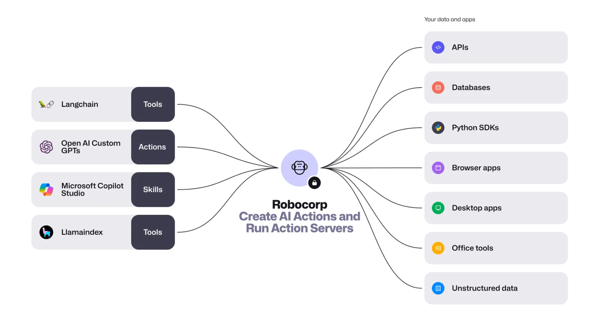

# Robocorp

<samp>[Docs](https://robocorp.com/docs) | [Blog](https://robocorp.com/blog) | [Examples](https://robocorp.com/portal) | [ReMark](https://chat.robocorp.com) | [Courses](https://robocorp.com/docs/courses) | [Slack](https://robocorp-developers.slack.com/) | [Youtube](https://www.youtube.com/@Robocorp) | [𝕏](https://twitter.com/RobocorpInc)</samp>

[](https://pypi.org/project/robocorp)
[](https://pypi.org/project/robocorp-action-server)
[](https://pepy.tech/project/robocorp)
[](https://github.com/robocorp/robocorp/issues)
[](https://opensource.org/licenses/Apache-2.0)

## 🐍 Create, deploy and operate Python AI Actions and Automations anywhere. 🤖

Robocorp is the easiest way to extend the capabilities of AI agents, assistants and copilots with custom actions, written in Python. Create and deploy tools, skills, loaders and plugins that securely connects any AI Assistant platform to your data and applications.



Looking for a replacement to RPA? Head over to our [Enterprise Python Automation site](https://robocorp.com/docs/quickstart-guide) for more.

---

## 🏃‍♂️ Quickstart

Install Robocorp Action Server:

```sh
# On macOS
brew install robocorp/tools/action-server

# On Linux or Windows
pip install robocorp-action-server
```

Bootstrap a new project from a template. You’ll be prompted for a name of the project:

```sh
action-server new
```

Navigate to the freshly created project folder and start the server:

```sh
cd my-project
action-server start --expose
```

Once that’s done, you’ll have an Action Server UI locally at [http://localhost:8080](http://localhost:8080)), and a public internet-facing URL (something like _twently-cuddly-dinosaurs.robocorp.link_).

---

## What makes a Python function an ⚡️Action?

Three key things to know are:

- [conda.yaml file](https://todo) that sets up your **Python environment and dependencies**
- [@action decorator](https://todo) that determines the **action entry point**
- [Type hints and docstring](https://todo) in Google-style to let AI agents know **what the Action does**.

---

### Add Action Server as a Toolkit to [🦜️🔗 Langchain](https://github.com/robocorp/langchain)

Robocorp Action Server comes with everything needed to connect it to your Langchain AI app project. The easiest way is to start with the template, provided in the Langchain project. Here’s how to do it!

```sh
# Install Langchain cli tool if not already there
pip install langchain-cli

# Create the template
langchain app new my-awesome-app --package action_server

# Start the template locally
langchain template serve
```

After running the steps above, you’ll have a Playground running at http://127.0.0.1:8000/playground where you can test the Actions.

Want to build your own things? Adding your own Robocorp AI Actions to a Langchain project is as easy as the code below. Just remember to change the URL of the Action Server if you are not running both the Action Server and Langchain app on the same machine.

```py
from langchain_robocorp import ActionServerToolkit

# Initialize Action Server Toolkit
toolkit = ActionServerToolkit(url="http://localhost:8080")
tools = toolkit.get_tools()
```

### Connect with OpenAI GPTs Actions

Once you have started the Action Server with `--expose` flag, you’ll get a URL available to the public, along with the authentication token. The relevant part of the output from the terminal looks like this, of course with your own details:

```sh
...
Uvicorn running on http://localhost:8080 (Press CTRL+C to quit)
🌍 URL: https://seventy-six-helpless-dragonflies.robocorp.link
🔑 Add following header api authorization header to run actions: { "Authorization": "Bearer xxx_xxx" }
```

Adding the Action Server hosted AI Action to your custom GPT is super simple, basically just navigate to “Actions” section of the GPT configuration, add the link to import the actions, and Add Authentication with Authentication method set to “API key” and Auth Type to “Bearer”.

---

## Why use Robocorp AI Actions

- ❤️ “when it comes to automation, the Robocorp suite is the best one” _[/u/disturbing_nickname](https://old.reddit.com/r/rpa/comments/18qqspn/codeonly_rpa_pet_project/kez2jds/?context=3)_
- ❤️ “Robocorp seems to be a good player in this domain” _[/u/thankred](https://old.reddit.com/r/rpa/comments/18r5gne/recommendation_for_open_source_or_somewhat_less/kez6aw6/?context=3)_
- ❤️ “Since you know Python, check out Robocorp. Their product is crazy good.” _[/u/Uomis](https://old.reddit.com/r/rpa/comments/18n5sah/c/ke8qz2g?context=3)_

Robocorp stack is hands down the easiest way to give AI agents more capabilities. It’s an end-to-end stack supporting every type of connection between AI and your apps and data. You are in control where to run the code, but everything is built for easiness, security, and scalability.

- 🔐 **Isolate AI from your data/apps** - short explanation.
- 🏎️ **Develop Actions faster** - less boilerplate code, ready made libraries to tons of things.
- ♻️ **Code reusability** - easily reuse action code across various AI frameworks and apps
- 🕵️ **Full audit data lineage** - Know all that happened

Without env management hell?

Zero code deployment - no need to learn the tricks with AWS Lambdas or similar

## Key Features

- Built-in integration to AI frameworks:
  - [Langchain Toolkit]() - comes with a template
  - one click deploy to OpenAI
- Comprehensive open-source automation tooling:
  - Playwright integrated - inspector in VS Code extension
  - Desktop automation on windows - inspector in VS Code extension
  - Remark code gen assistant free of charge
  - Automation libs for pdf, MS Office, Google docs and what not (browse here)
  - Extend with any pypi package
- Environment management made insanely easy - uses [RCC](https://github.com/robocorp/rcc) for creating, managing, and distributing Python-based self-contained action packages.
- Need to say something about security!
- Detailed logging - without “print” statements. Able to provide full traceability of every execution making it easy to spot and fix problems, as well as to provide enterprise-level auditability.
- Run Action Server locally, and expose it to public internet right from your laptop.
- Deploy, monitor, and scale through Robocorp cloud (coming soon)

## Roadmap

- [x] Action Server Installer
- [x] Expose actions to public URL
- [ ] Dev convenience
  - [ ] Run `@actions` like `@tasks` in vscode
  - [ ] Hot reload
  - [ ] Secret management
  - [ ] Shared asset storage
  - [ ] Action update history
  - [ ] docstring validator
- [ ] MS Copilot Studio support
- [ ] More complex input args
- [ ] Explicit action user approval
- [ ] Stateful actions
- [ ] Link Action Servers to [Control Room]()
  - [ ] Scalability / load-balancing

## Contributing and issues

> [!NOTE]
> Useful information that users should know, even when skimming content.

> [!TIP]
> Helpful advice for doing things better or more easily.

> [!IMPORTANT]
> Key information users need to know to achieve their goal.

> [!WARNING]
> Urgent info that needs immediate user attention to avoid problems.

> [!CAUTION]
> Advises about risks or negative outcomes of certain actions.

## Contributors

<!-- readme: contributors -start -->


<!-- readme: contributors -end -->
