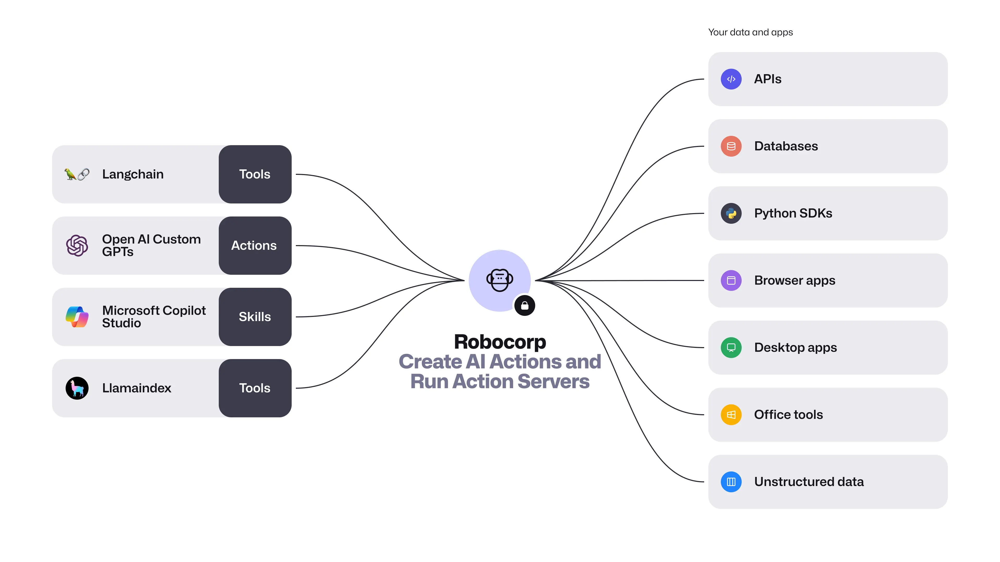

<samp>[Docs](https://robocorp.com/docs) | [Blog](https://robocorp.com/blog) | [Examples](https://github.com/robocorp/actions-cookbook) | [ReMark](https://chat.robocorp.com) | [Courses](https://robocorp.com/docs/courses) | [Slack](https://robocorp-developers.slack.com/) | [Youtube](https://www.youtube.com/@Robocorp) | [𝕏](https://twitter.com/RobocorpInc)</samp>

[](https://pypi.org/project/robocorp)
[](https://pypi.org/project/robocorp-action-server)
[](https://pepy.tech/project/robocorp)
[](https://github.com/robocorp/robocorp/issues)
[](https://opensource.org/licenses/Apache-2.0)

# Create, deploy and operate 🐍 Python Automations <br/> and AI Actions anywhere.

Robocorp is the easiest way to extend the capabilities of AI agents, assistants and copilots with custom actions, written in Python. Create and deploy tools, skills, loaders and plugins that securely connect any AI Assistant platform to your data and applications.

Robocorp Action Server makes your Python scripts compatible with ChatGPT and LangChain by automatically creating and exposing an API based on function declaration, type hints and docstrings. Just add `@action` and start!

<picture>
  <source media="(prefers-color-scheme: dark)" srcset="./docs/include/robocorp-flow-dark.webp">
  
</picture>

Looking for a replacement to RPA? Head over to our [Enterprise Python Automation site](https://robocorp.com/docs/quickstart-guide) for more.

---

<div id="quickstart"></div>

# 🏃‍♂️ Quickstart

Install Robocorp Action Server:

<details open>
<summary><b>For macOS</b></summary>

```sh
brew update
brew install robocorp/tools/action-server
```

</details>

<details>
<summary><b>For Windows</b></summary>

```sh
# Download Robocorp Action Server
curl -o action-server.exe https://downloads.robocorp.com/action-server/releases/latest/windows64/action-server.exe
```

You can download/move the executable into a folder that is in your `PATH`, or you can [add the folder into PATH](https://www.architectryan.com/2018/03/17/add-to-the-path-on-windows-10/) so that you can call `action-server` wherever you are.

</details>

<details>
<summary><b>For Linux</b></summary>

```sh
# Download Robocorp Action Server
curl -o action-server https://downloads.robocorp.com/action-server/releases/latest/linux64/action-server
chmod a+x action-server

# Add to PATH or move to a folder that is in PATH
sudo mv action-server /usr/local/bin/
```

</details>
<br/>

Bootstrap a new project from a template. You’ll be prompted for the name of the project:

```sh
action-server new
```

Navigate to the freshly created project folder and start the server:

```sh
cd my-project
action-server start --expose
```

👉 You should now have an Action Server running locally at: http://localhost:8080, to open the web UI.

👉 Using the --expose -flag, you also get a public internet-facing URL (something like _twently-cuddly-dinosaurs.robocorp.link_) and an API key. These are the details that you need to configure your AI Agent.

Head over to [Action Server docs](./action_server/README.md) for more.

---

<div id="python-action"></div>

# What makes a Python function an⚡️Action?

1️⃣ `conda.yaml` file that sets up your **Python environment and dependencies**:

```yaml
channels:
  - conda-forge

dependencies:
  - python=3.10.12
  - pip=23.2.1
  - robocorp-truststore=0.8.0
  - pip:
      - robocorp==1.4.0
      - robocorp-actions==0.0.4
      - numpy==1.26.3
```

<details>
  <summary>🙋‍♂️ "Why not just pip install...?"</summary>

Think of this as an equivalent of the requirements.txt, but much better. 👩‍💻 With `conda.yaml` you are not just controlling your PyPI dependencies, you control the complete Python environment, which makes things repeatable and easy.

👉 You will probably not want run the Actions just on your machine, so by using `conda.yaml`:

- You can avoid `Works on my machine` -cases
- You do not need to manage Python installations on all the machines
- You can control exactly which version of Python your automation will run on
  - ..as well as the pip version to avoid dep. resolution changes
- No need for venv, pyenv, ... tooling and knowledge sharing inside your team.
- Define dependencies in conda.yaml let our tooling do the heavy lifting.
- You get all the content of [conda-forge](https://prefix.dev/channels/conda-forge) without any extra tooling

> Dive deeper with [these](https://github.com/robocorp/rcc/blob/master/docs/recipes.md#what-is-in-condayaml) resources.

</details>
<br/>

2️⃣ [@action decorator](./actions) that determines the **action entry point** and [Type hints and docstring](./actions#describe-your-action) to let AI agents know **what the Action does** in natural language.

```py
@action
def greeting(name: str) -> str:
    """
    Greets the user

    Args:
        name (str): The user name

    Returns:
        str: Final user greeting
    """
```

---

<div id="connect-gpt"></div>

## Connect with OpenAI GPTs Actions

Once you have started the Action Server with `--expose` flag, you’ll get a URL available to the public, along with the authentication token. The relevant part of the output from the terminal looks like this, of course with your own details:

```sh
...
Uvicorn running on http://localhost:8080 (Press CTRL+C to quit)
🌍 URL: https://seventy-six-helpless-dragonflies.robocorp.link
🔑 Add following header api authorization header to run actions: { "Authorization": "Bearer xxx_xxx" }
```

<h3 id="actions-video" align="center">
  <a href="https://www.youtube.com/watch?v=7aq6QDCaUmA">
    👉 Example video in Youtube 👈
  </a>
</h3>

Adding the Action Server-hosted AI Action to your custom GPT is super simple: basically just navigate to “Actions” section of the GPT configuration, add the link to import the actions, and **Add Authentication** with **Authentication method** set to _“API key”_ and **Auth Type** to _“Bearer”_.

> **TIP:**<br/>
> Use the `@action(is_consequential=False)` flag to avoid the user needing to accept the action execution separately each time on your GPT.

<div id="langchain"></div>

## Add Action Server as a Toolkit to [🦜️🔗 LangChain](https://github.com/robocorp/langchain)

Robocorp Action Server has everything needed to connect it to your Langchain AI app project. The easiest way is to start with the template provided in the Langchain project. Here’s how to do it:

```sh
# Install LangChain cli tool if not already there
pip install langchain-cli

# Create a new LangChain app using Action Server template
langchain app new my-awesome-app --package robocorp-action-server
```

Then define the route inside the created `./my-awesome-app/app/server.py` file:

```diff
from langserve import add_routes
+ from robocorp_action_server import agent_executor as action_server_chain

# Edit this to add the chain you want to add
- add_routes(app, NotImplemented)
+ add_routes(app, action_server_chain, path="/robocorp-action-server")
```

After the setup make sure you have:

- An environment variable `OPENAI_API_KEY` with your OpenAI API key set
- You have a running Action Server at http://localhost:8080

Finally, inside the project directory `./my-awesome-app` spin up a LangServe instance directly by:

```sh
langchain serve
```

After running the steps above, you’ll have a Playground available at http://127.0.0.1:8000/robocorp-action-server/playground/ where you can test your Actions with an AI agent.

**Want to build your own thing?** Adding your Robocorp AI Actions to a Langchain project is as easy as the code below. Just remember to change the URL of the Action Server if you are not running both the Action Server and Langchain app on the same machine.

```py
from langchain_robocorp import ActionServerToolkit

# Initialize Action Server Toolkit
toolkit = ActionServerToolkit(url="http://localhost:8080")
tools = toolkit.get_tools()
```

---

<div id="why-actions"></div>

## Why use Robocorp AI Actions

- ❤️ “when it comes to automation, the Robocorp suite is the best one” _[/u/disturbing_nickname](https://old.reddit.com/r/rpa/comments/18qqspn/codeonly_rpa_pet_project/kez2jds/?context=3)_
- ❤️ “Robocorp seems to be a good player in this domain” _[/u/thankred](https://old.reddit.com/r/rpa/comments/18r5gne/recommendation_for_open_source_or_somewhat_less/kez6aw6/?context=3)_
- ❤️ “Since you know Python, check out Robocorp. Their product is crazy good.” _[/u/Uomis](https://old.reddit.com/r/rpa/comments/18n5sah/c/ke8qz2g?context=3)_

Robocorp stack is hands down the easiest way to give AI agents more capabilities. It’s an end-to-end stack supporting every type of connection between AI and your apps and data. You are in control where to run the code and everything is built for easiness, security, and scalability.

- 🔐 **Decouple AI and Actions that touches your data/apps** - Clarity and security with segregation of duties between your AI agent and code that touches your data and apps. Build `@action` and use from multiple AI frameworks.
- 🏎️ **Develop Actions faster with `robocorp` automation libraries** - Robocorp libraries and the Python ecosystem lets you act on anything - from data to API to Browser to Desktops.
- 🕵️ **Observability out of the box** - Log and trace every `@action` run automatically without a single `print` statement. _Pro tip: connect [LangSmith](https://www.langchain.com/langsmith) traces with Action logs!_
- 🤯 **No-pain Python environment management** - Don't do [this](https://xkcd.com/1987/). Robocorp manages a full Python environment for your actions with ease.
- 🚀 **Deploy with zero config and infra** - One step deployment, and you'll be connecting your `@action` to AI apps like Langchain and OpenAI GPTs in seconds.

<div id="inspiration"></div>

## Inspiration

Check out these example projects for inspiration.

- 🐣 [Simplest possible AI Action](https://github.com/robocorp/actions-cookbook/tree/master/greeter)
- 🤡 [Get a random joke or jokes per theme. Showcases how easy it is to work with APIs.](https://github.com/robocorp/actions-cookbook/tree/master/api-jokes)
- 🕸️ [Open a local Playwright browser and make some Google searches.](https://github.com/robocorp/actions-cookbook/tree/master/browser-google)
- 🖥️ [Securely fetch contents of `.txt` and `.pdf` files from your local machine's folder in real time.](https://github.com/robocorp/actions-cookbook/tree/master/desktop-files)

Build more `@actions` and be awesome! We'd love to hear and see what have you built. Join our [Slack community](https://robocorp-developers.slack.com/) to share your work, or post it in the [Discussions](https://github.com/robocorp/robocorp/discussions/categories/show-and-tell). We'll soon start showcasing the best from the community here!

<div id="roadmap"></div>

## Roadmap

- [x] ~~Action Server `brew install` for Mac users~~
- [x] ~~Expose actions to public URL~~
- [x] ~~Resume previously exposed session~~
- [ ] Run and debug `@actions` like `@tasks` with [Robocorp VS Code Extension](https://marketplace.visualstudio.com/items?itemName=robocorp.robocorp-code) [#230](https://github.com/robocorp/robocorp/issues/230)
- [ ] Docstring to OpenAPI specs improvements [#236](https://github.com/robocorp/robocorp/issues/236), [#250](https://github.com/robocorp/robocorp/issues/250)
- [ ] Support JSON/Dicts for inputs and outputs [#266](https://github.com/robocorp/robocorp/issues/266)
- [ ] Action can access request headers [#167](https://github.com/robocorp/robocorp/issues/167)
- [ ] MS Copilot Studio manifest file support
- [ ] Action Gallery for prebuilt actions
- [ ] Llamaindex Tools support
- [ ] Link and deploy Action Servers to [Control Room](https://cloud.robocorp.com/)
- [ ] Hot reload of actions after a change
- [ ] Explicit action user approval
- [ ] Stateful actions

<div id="contribute"></div>

## Contributing and issues

> ⭐️ First, please star the repo - your support is highly appreciated!

- 🚩 Issues – our [GitHub Issues](https://github.com/robocorp/robocorp/issues) is kept up to date with bugs, improvements, and feature requests
- 🙋 Help - you are welcome to [join our Community Slack](https://robocorp-developers.slack.com/) if you experience any difficulty getting setup
- 🌟 Contribution and recognition – Start [here](https://github.com/robocorp/robocorp/blob/master/CONTRIBUTING.md), [PR's](https://github.com/robocorp/robocorp/pulls) are welcome!
- 🔐 Refer to our [Security policy](https://robocorp.com/.well-known/security.txt) for details

### Contributors


