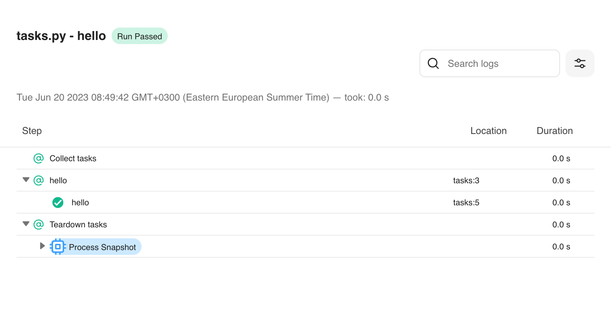

<a href="https://github.com/robocorp/robo/">
  
</a>

## Robo is an all-in-one Python automation framework

### Create, develop, run, and deploy your automation code with Robo - and operate it all with [Control Room](https://robocorp.com/products/control-room)

<br/>
<details open="open">
<summary>Table of Contents</summary>

- [What is Robo?](#what-is-robo)
- [Libraries](#libraries)
- [CLI](#cli)
- [Licence](#licence)

</details>

---

> **Warning**<br/>
> Robo CLI is not yet recommended for production use, while libraries are ready for prime time. Refer to Robocorp's production tooling for managing Python projects [here](https://robocorp.com/docs/quickstart-guide/python).

## What is Robo?

Robo is both a CLI for managing your Python projects, and a set of libraries for automating your tasks. It handles your entire automation development lifecycle. Robo's key features are:

- **Isolated environments.** Get started without installing any other tools, not even Python. Robo automatically creates fully isolated environments for projects, which can be reproduced anywhere else.
- **Batteries included.** Robo ships with a broad set of libraries for automating common tasks, be it browser automation, document processing, or navigating desktop applications.
- **Reduce boilerplate.** Turn your Python snippet into a runnable automation with minimal effort. Robo can be used to execute your code in other environments, and deployed in Control Room without any infrastructure work.
- **Troubleshoot easily.** Robo automatically traces your automation task, and create an easy-to-read report of what happened. You can quickly see if something went wrong - and how to fix it.

Robo is designed to function as a single tool that helps you more easily get things done. It is entirely compatible with the PyPI and Conda ecosystems, but also brings in a set of libraries designed from the ground up to be focused on automation.

## Getting started

> **Note**<br/>
> If you are new to Robocorp, and looking to work on a production-grade project, please start from our official [Quick Start Guide](https://robocorp.com/docs/quickstart-guide).

To install Robo, visit our [downloads site](https://downloads.robocorp.com/robo/releases/index.html) to get the latest version.

After downloading, you can create a new project with:
```bash
robo new
```

It will interactively prompt for project name and type, after which it'll create a new environment for the project. This might take a few minutes for the first time, but results are cached and will be quick on later iterations.

Looking at the created `tasks.py`, the runnable portions of the project are defined with a `@task` decorator. It tells `robo` that the function implements one specific automation task, which can then later be scheduled to run in [Control Room](https://robocorp.com/products/control-room).

```python
from robocorp.tasks import task

@task
def hello():
    print("Hello World!")
```

The above minimum example defines a task, which can then be executed with `robo run`. Once execution is finished, you can view the log generated (by default) to log.html file.



Check out the [docs page](https://robocorp.com/docs) for more in-depth tutorials, and refer to the [API documentation](docs/README.md) to learn how to use the different libraries. If you have further questions or want to help, join our [Forum](https://forum.robocorp.com/).

## Libraries

The framework includes Python libraries for configuring project entrypoints and controlling features such as a logging. The project also provides an extensive selection of libraries for the most common automation tasks, and anything else can be easily done through what is already available in the Python ecosystem.

### Metapackage

The easiest way to get started is to install the [`robocorp`](./meta) metapackage, which includes the core features of the framework, such as logging and Control Room integration:

[](https://pypi.org/project/robocorp/)

### Packages

It's also possible to install individual components of the project as separate dependencies:

| Name                                | Release                                                                                                                                          | Description                                                                                                                       | Metapackage |
|-------------------------------------|--------------------------------------------------------------------------------------------------------------------------------------------------|-----------------------------------------------------------------------------------------------------------------------------------| --- |
| [`robocorp.tasks`](./tasks)         | [](https://pypi.org/project/robocorp-tasks/)                 | Create entrypoints for your automation project.                                                                                   | ✅ |
| [`robocorp.log`](./log)             | [](https://pypi.org/project/robocorp-log/)                         | Configure and control the execution log.                                                                                          | ✅ |
| [`robocorp.vault`](./vault)         | [](https://pypi.org/project/robocorp-vault/)                 | Store secret values in Control Room and access them during the execution.                                                         | ✅ |
| [`robocorp.workitems`](./workitems) | [](https://pypi.org/project/robocorp-workitems/) | Interact with Control Room work items; Read data from previous steps, create output data.                                         | ✅ |
| [`robocorp.storage`](./storage)     | [](https://pypi.org/project/robocorp-storage/)         | Store assets in Control Room and manage them during the execution.                                                                | ✅ |
| [`robocorp.browser`](./browser)     | [](https://pypi.org/project/robocorp-browser/)         | Automate actions in a browser, powered by [Playwright](https://playwright.dev/).                                                  | - |
| [`robocorp.windows`](./windows)     | [](https://pypi.org/project/robocorp-windows/)         | Automate Windows desktop applications, powered by [uiautomation](https://github.com/yinkaisheng/Python-UIAutomation-for-Windows). | - |
| [`robocorp.excel`](./excel)         | [](https://pypi.org/project/robocorp-excel/)                 | Read and write Excel files directly, with support for both .xlsx and .xls.                                                        | - |
| [`robocorp.http`](./http)           | [](https://pypi.org/project/robocorp-http/)                     | Download files easily, or make custom HTTP requests.                                                                              | - |

> **Note**<br/>
> For additional automation capabilities on the Robocorp platform, please refer to the wide array of libraries and keywords available in [RPA Framework](https://robocorp.com/docs/libraries/rpa-framework).

## CLI

> **Warning**<br/>
> Robo CLI is not yet recommended for production use, while libraries are ready for prime time. Refer to Robocorp's production tooling for managing Python projects [here](https://robocorp.com/docs/quickstart-guide/python).

The `robo` CLI is used to manage and run your projects during development, and it bundles your project for deployment.

#### `robo new`

Create an entirely new Python project, isolated from the rest of your system. No need to install Python separately or manually manage virtual environments.

#### `robo run`

Run your defined Python tasks. Robo instruments the running code, and generates a pretty report of what was executed.

#### `robo exec`

Easily run an arbitrary command within the isolated environment, such as shell commands or a locally installed application.

#### `robo lock`

Generate configuration files compatible with [rcc](https://github.com/robocorp/rcc).

#### `robo export`

Package your project as a Control Room compatible bundle, ready for deployment.

## License

Source code licensed under [Apache-2.0](./LICENSE).

The End User License Agreement (EULA) for the distributed `robo` binary can be found [here](https://cdn.robocorp.com/legal/Robocorp-EULA-v1.0.pdf).
